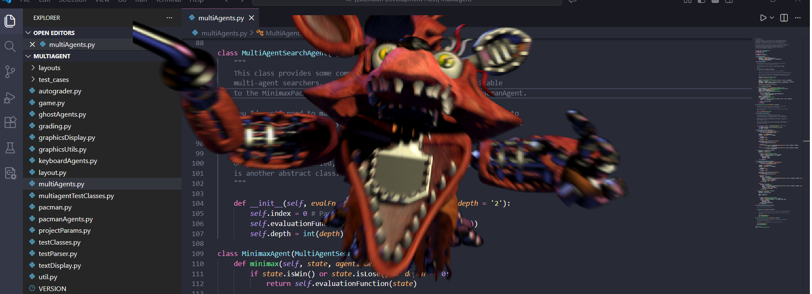

# 1 in 10000 chance of Withered Foxy Jumpscare Every Second

## Overview:

A 1/10000 Chance for Withered Foxy Jumpscare Every Second vscode extension inspired by <a href="https://steamcommunity.com/sharedfiles/filedetails/?id=3481943642"> the terraria mod by **YMY** with the same name </a>

## Screenshot:

## Requirements 

    [Python](https://www.python.org/downloads/).

## Known Issues

    1.Scary
    2.Can't change frenquency (planned)
    3.Can't change volume (planned)

## Release Notes
### 1.0.0

Initial release
### 1.0.3

Fix issues with readme, marketplace extension page, and added an icon.

### 2.0.0

Removed PySide6 dependency.

## Note:

Inspired by "1/10000 Chance for Withered Foxy Jumpscare Every Second" by **YMY** from TmodLoader.
Used assets from <a href= "https://github.com/AlenDio0/FNAF-Jumpscare">this repository</a>, by <a href= "https://github.com/AlenDio0">AlenDio0</a>.

You are a human being, capable of making your own judgements and decisions. Use this at your own risk.
 
**Enjoy!**
